# energy-lakehouse-databricks

[](https://github.com/armrosadev1991/energy-lakehouse-databricks/actions/workflows/ci.yml)

A complete **medallion architecture** (bronze → silver → gold) for smart-meter energy data on
Databricks, packaged as a **Declarative Automation Bundle** (formerly *Databricks Asset Bundle*),
running on **serverless compute** with **Unity Catalog**, tested with **pytest on local Spark +
Delta**, and deployed by **GitHub Actions**.

The transformations deliberately lean on Spark's analytical SQL: `lag`/`lead`, `date_trunc`,
`rank`/`dense_rank`/`row_number`, `percent_rank`, `cume_dist`, `ntile`, `first_value`/`last_value`,
ROWS vs RANGE window frames, running totals, moving averages, gaps-and-islands, SCD Type 2,
point-in-time joins, `GROUPING SETS`, `pivot`, `max_by`, `percentile_approx` and more —
see the [window-function index](#window-function-index).

```mermaid
flowchart LR
    subgraph landing["UC Volume /Volumes/&lt;catalog&gt;/&lt;schema&gt;/landing"]
        R[meter_readings/*.csv]:::raw
        S[sites/*.csv]:::raw
        W[weather/*.csv]:::raw
        P[prices/*.csv]:::raw
        G[generation_mix/*.csv]:::raw
    end
    subgraph bronze["bronze_* (append-only, all strings, lineage columns)"]
        B[(5 raw tables)]
    end
    subgraph silver["silver_* (typed, validated, de-duplicated, MERGE)"]
        SR[(meter_readings<br/>hour-aligned, forward-filled, gap-aware)]
        SS[(sites<br/>SCD Type 2)]
        SW[(weather)] ; SP[(prices)] ; SG[(generation_mix)]
    end
    subgraph gold["gold_* (window-function analytics)"]
        G1[(site_daily_consumption)] ; G2[(site_monthly_kpis)] ; G3[(peak_demand_hours)]
        G4[(outage_streaks)] ; G5[(energy_cost_daily)] ; G6[(weather_sensitivity_monthly)]
        G7[(generation_kpis_hourly)] ; G8[(consumption_rollup_monthly)]
        G9[(consumption_distribution_monthly)] ; G10[(consumption_anomalies)]
    end
    Q[(ops_data_quality_results)]
    landing --> B --> silver --> gold --> Q
    classDef raw fill:#f4f4f4,stroke:#999;
```



## Contents

- [What gets deployed](#what-gets-deployed)
- [Data model](#data-model)
- [Window-function index](#window-function-index)
- [Project layout](#project-layout)
- [Run it locally](#run-it-locally)
- [Deploy to Databricks](#deploy-to-databricks)
- [CI/CD with GitHub Actions](#cicd-with-github-actions)
- [Data quality](#data-quality)
- [Design notes](#design-notes)

## What gets deployed

`databricks bundle deploy` builds the `energy_lakehouse` wheel from `src/` and creates, per target:

| Resource | Definition | Notes |
| --- | --- | --- |
| Unity Catalog schema `<catalog>.<schema>` | `resources/unity_catalog.yml` | `energy` in prod, `dev_<user>_energy` in dev |
| Managed volume `landing` | `resources/unity_catalog.yml` | raw CSV drop zone, one folder per feed |
| Job `energy_medallion_pipeline` | `resources/energy_medallion.job.yml` | serverless, environment version 5, daily trigger (paused in dev) |

The job is a strict chain of five `python_wheel_task`s that all call the same entry point with a
different `--stage`:

```
generate_sample_data ──▶ bronze_ingest ──▶ silver_transform ──▶ gold_analytics ──▶ data_quality
```

Job-level parameters (`catalog`, `schema`, `landing_path`, `n_sites`, `n_days`) can be overridden
per run, e.g. `databricks bundle run energy_medallion_pipeline --params n_days=180`.

## Data model

The **synthetic generator** (`src/energy_lakehouse/datagen`) is deterministic (seeded) and produces
a realistic, deliberately messy feed set: duplicate rows, restated readings that land in the *next*
day's file, timestamps a few minutes past the hour, null and negative consumption, multi-hour
outages, windows with no rows at all, a consumption spike, and site attribute changes over time.

| Feed / table | Grain | Key points |
| --- | --- | --- |
| `bronze_meter_readings` | one row per landed CSV row | `reading_ts`, `kwh_consumed`, `kwh_exported`, `voltage_v`, `quality_flag` + `_source_file`, `_ingested_at`, `_batch_id` |
| `bronze_sites` | one row per site snapshot | `tariff_plan`, `region`, `customer_segment`, `contracted_kw`, `effective_from` |
| `bronze_weather` / `bronze_prices` / `bronze_generation_mix` | hourly per region | temperature, irradiance, wind; day-ahead €/MWh; MW per source |
| `silver_meter_readings` | **(site_id, reading_hour)** — unique | `kwh_filled` (forward-filled), `is_imputed`, `gap_hours_before`, `kwh_prev_hour`, `kwh_delta_vs_prev` |
| `silver_sites` | **(site_id, valid_from)** — SCD2 | `valid_from`, `valid_to`, `is_current`, `version`, `attr_hash` |
| `silver_weather` | (region, observed_hour) | forward-filled temperature, `temperature_prev_day_c`, heating/cooling degree hours |
| `silver_prices` | (region, market, price_hour) | `price_prev_hour`, `price_change_pct`, `price_rank_in_day`, `is_peak_price_hour` |
| `silver_generation_mix` | (region, generation_hour, source) | `region_total_mw` (window sum), `share_pct`, `is_renewable` |
| `gold_site_daily_consumption` | site × day | totals, peak hour, load factor, DoD/WoW %, 7-row and 30-calendar-day averages, MTD running total |
| `gold_site_monthly_kpis` | site × month | MoM %, YTD, rank / dense_rank / row_number, percent_rank, cume_dist, quartile, share of region, top/bottom site |
| `gold_peak_demand_hours` | site × day × top-3 hours | rank vs dense_rank vs row_number on ties, first/last hour of the day, contract utilisation |
| `gold_outage_streaks` | one row per streak | gaps-and-islands: `ZERO_CONSUMPTION` runs and `MISSING_DATA` holes, ranked by duration |
| `gold_energy_cost_daily` | site × day | cost at day-ahead prices, kWh-weighted price, MTD spend, costliest-day rank, cost quartile |
| `gold_weather_sensitivity_monthly` | site × month | Pearson correlation and OLS slope of kWh on temperature, kWh per heating-degree-hour |
| `gold_generation_kpis_hourly` | region × hour | renewable share, 24 h rolling average, same-hour-yesterday, decile, pivoted MW per source |
| `gold_consumption_rollup_monthly` | GROUPING SETS | month → region → segment → tariff totals with `grouping_id`, share of month |
| `gold_consumption_distribution_monthly` | site × month | cume_dist / percent_rank / decile across the population, position vs segment median & p90 |
| `gold_consumption_anomalies` | anomalous hours | z-score against the trailing-168-row baseline, SPIKE/DROP, severity rank in day |
| `ops_data_quality_results` | one row per check per run | 23 built-in checks, see [Data quality](#data-quality) |

## Window-function index

Where each construct lives, so you can jump straight to a worked example.

| Construct | Used for | Where |
| --- | --- | --- |
| `row_number()` | keep the latest restatement per `(site_id, reading_hour)`; peak hour of the day; SCD2 version numbers | `silver/readings.py`, `gold/daily.py`, `silver/sites.py` |
| `rank()` vs `dense_rank()` vs `row_number()` | top-N hours with ties, rank in region, costliest day | `gold/peaks.py`, `gold/monthly.py`, `gold/cost.py` |
| `percent_rank()`, `cume_dist()` | where a site sits in the monthly population | `gold/monthly.py` (SQL), `gold/distribution.py` |
| `ntile(4)`, `ntile(10)` | consumption quartile, renewable-share decile, cost quartile | `gold/monthly.py`, `gold/generation.py`, `gold/cost.py` |
| `lag()`, `lead()` | previous/next hour, day, week, month; price change; SCD2 change detection and version closing | `silver/readings.py`, `silver/prices.py`, `silver/sites.py`, `gold/daily.py`, `gold/monthly.py`, `gold/outages.py` |
| `date_trunc('hour' / 'day' / 'month')` | align readings to the hour, daily and monthly rollups | `silver/*.py`, `gold/daily.py`, `gold/monthly.py`, `gold/rollup.py` |
| `last(col, ignorenulls=True)` over `rowsBetween(unboundedPreceding, currentRow)` | forward-fill missing readings / temperatures | `silver/readings.py`, `silver/weather.py` |
| `first_value()`, `last_value()` with explicit full frame | first/last hour of the day, top/bottom site in a region | `gold/peaks.py`, `gold/monthly.py` |
| `sum() over (... rows unbounded preceding)` | month-to-date and year-to-date running totals | `gold/daily.py`, `gold/monthly.py`, `gold/cost.py` |
| `avg() over rowsBetween(-6, 0)` **vs** `rangeBetween(-29, 0)` | 7-*row* moving average vs 30-*calendar-day* average (the tests show how they differ across a gap) | `gold/daily.py` |
| `avg()/stddev_samp() over rowsBetween(-168, -1)` | trailing-week baseline for z-score anomaly detection | `gold/anomalies.py` |
| `sum() over (partition by ...)` (aggregate as window) | share of regional total / of the region's month | `silver/generation.py`, `gold/monthly.py` |
| Gaps-and-islands (`hour_index - row_number()`) | consecutive zero-consumption runs | `gold/outages.py` |
| SCD Type 2 (`lag(hash)`, `lead(effective_from)`) and point-in-time join | site dimension history, enrich facts with the version valid at the time | `silver/sites.py` |
| `GROUPING SETS` + `grouping_id()` | hierarchical totals in one pass | `gold/rollup.py` (SQL) |
| `pivot()`, `max_by()`, `min_by()` | wide generation mix, dominant source | `gold/generation.py` |
| `percentile_approx()` | segment median and p90 | `gold/distribution.py` |
| `covar_samp`, `var_samp`, `stddev_samp` → Pearson r, OLS slope/intercept | weather sensitivity (ANSI-safe, see design notes) | `gold/weather.py` |
| Named `WINDOW` clause, `NULLIF`, `try_divide` | monthly KPIs written in Spark SQL | `gold/monthly.py` |
| `MERGE INTO ... WHEN MATCHED UPDATE SET * WHEN NOT MATCHED INSERT *` | idempotent silver upserts | `io.py` |

A longer walk-through with the exact expressions is in [`docs/window-functions.md`](docs/window-functions.md).

## Project layout

```
databricks.yml                    bundle root: artifacts, variables, dev/prod targets
resources/
  unity_catalog.yml               schema + landing volume
  energy_medallion.job.yml        the serverless job (5 wheel tasks)
src/energy_lakehouse/
  cli.py                          `main` entry point (python_wheel_task.entry_point)
  pipeline.py                     stage orchestration
  config.py  io.py  schemas.py    config, Delta I/O (SQL MERGE), raw feed contracts
  datagen/                        deterministic synthetic energy data
  bronze/                         idempotent CSV ingestion with lineage
  silver/                         typing (ANSI-safe), dedupe, SCD2, forward-fill, gaps
  gold/                           ten analytics tables, one module each
  quality/                        declarative data-quality checks
tests/
  conftest.py                     local Spark + Delta session, throw-away schema per test
  unit/                           hand-computed expectations for every window function
  integration/                    full medallion run + idempotency on local Spark
scripts/check_bundle_schema.py    bundle YAML vs the CLI's JSON schema (offline)
.github/workflows/                ci.yml, deploy-dev.yml, deploy-prod.yml
fixtures/sample/                  a tiny generated sample of every feed, for reading
```

## Run it locally

Requirements: [uv](https://docs.astral.sh/uv/), Java 17+ (for local PySpark), and optionally
the [Databricks CLI](https://docs.databricks.com/aws/en/dev-tools/cli/install) ≥ 0.250.

```bash
uv sync --group dev          # Python 3.12 venv with pyspark 4.0 + delta-spark 4.0
make check                   # ruff + mypy + unit tests + integration test + bundle schema check
uv run pytest -m "not integration"   # ~2 min: unit tests on tiny hand-built DataFrames
uv run pytest -m integration          # ~3 min: generate → bronze → silver → gold → quality, twice
```

The pipeline can also be driven from Python against any Spark session — the integration test does
exactly what the job does, with `catalog=spark_catalog` and a temp schema:

```python
from energy_lakehouse.config import PipelineConfig
from energy_lakehouse.pipeline import STAGES, GenerateOptions, run_stages

cfg = PipelineConfig(catalog="spark_catalog", schema="energy_local", landing_path="/tmp/landing")
run_stages(spark, cfg, STAGES, GenerateOptions(n_sites=8, n_days=30))
```

## Deploy to Databricks

1. Authenticate the CLI to your workspace (any method in
   [unified auth](https://docs.databricks.com/aws/en/dev-tools/auth/) works; a profile is simplest):

   ```bash
   databricks configure --profile energy-dev   # or set DATABRICKS_HOST + DATABRICKS_TOKEN
   ```

   `workspace.host` is intentionally **not** hard-coded in `databricks.yml` (the CLI does not allow
   variables there); pass `--profile`, set `DATABRICKS_HOST`, or add
   `workspace: { host: https://... }` to a target if you prefer pinning it.

2. Pick the catalog (`main` by default) — override with `--var="catalog=my_catalog"` or
   `BUNDLE_VAR_catalog=my_catalog`. The deploying identity needs `USE CATALOG` + `CREATE SCHEMA`
   on it and permission to use serverless compute.

3. Validate, deploy, run:

   ```bash
   databricks bundle validate -t dev --profile energy-dev
   databricks bundle deploy   -t dev --profile energy-dev
   databricks bundle run      -t dev --profile energy-dev energy_medallion_pipeline
   ```

   In `dev` you get your own copy: schema `main.dev_<you>_energy`, job
   `[dev <you>] energy_medallion_pipeline` with its schedule paused. Tables appear under
   `main.dev_<you>_energy.bronze_*`, `silver_*`, `gold_*`, `ops_*`.

4. Production is deployed by CI (below) as a service principal, into
   `/Workspace/Users/<service-principal-id>/.bundle/energy_lakehouse/prod`. To do it by hand:
   `BUNDLE_VAR_service_principal_id=<app-id> databricks bundle deploy -t prod`.

## CI/CD with GitHub Actions

| Workflow | Trigger | What it does |
| --- | --- | --- |
| `ci.yml` | pull requests, pushes to `main` | ruff, mypy, unit + integration tests on local Spark, build wheel, bundle YAML vs CLI JSON schema; `bundle validate -t dev` when a workspace is configured |
| `deploy-dev.yml` | push to `main`, manual | `bundle validate` → `deploy -t dev` → `run energy_medallion_pipeline` (real integration run on serverless) |
| `deploy-prod.yml` | GitHub release published, manual | `deploy -t prod` (+ optional run) behind the `prod` environment's required reviewers |

The workflows follow the [Databricks GitHub Actions guidance](https://docs.databricks.com/aws/en/dev-tools/ci-cd/github):
`databricks/setup-cli`, `DATABRICKS_BUNDLE_ENV` to select the target, and **OAuth token federation
(OIDC)** so no long-lived secret is stored.

### One-time GitHub setup

1. In Databricks, create a service principal and a **GitHub Actions federation policy** for it
   ([docs](https://docs.databricks.com/aws/en/dev-tools/auth/provider-github)). The token subject
   must match the environment: `repo:armrosadev1991/energy-lakehouse-databricks:environment:dev`
   and `...:environment:prod`.
2. In GitHub → *Settings → Environments*, create `dev` and `prod`; add **required reviewers** on
   `prod`.
3. Per environment, set:

   | Kind | Name | Value |
   | --- | --- | --- |
   | variable | `DATABRICKS_HOST` | `https://<workspace>.cloud.databricks.com` |
   | variable | `DATABRICKS_CATALOG` | catalog name (defaults to `main`) |
   | variable | `NOTIFICATION_EMAIL` | prod failure notifications (optional) |
   | secret | `DATABRICKS_CLIENT_ID` | the service principal's application ID |

   Prefer a personal access token instead? Replace the three `DATABRICKS_AUTH_TYPE` /
   `DATABRICKS_CLIENT_ID` lines with `DATABRICKS_TOKEN: ${{ secrets.DATABRICKS_TOKEN }}`.

Also set `DATABRICKS_HOST` once at **repository** level: it gates the `bundle-validate` CI job and
both deploy workflows, so a fresh fork stays green until a workspace is wired up (environment-level
values override it per target).

## Data quality

`energy_lakehouse.quality` runs 23 declarative checks as the last job task and appends the results
to `ops_data_quality_results` (one row per check per `run_id`). Any failing check with severity
`error` raises `DataQualityError`, which fails the task — a broken run never looks green. Examples:

- `silver_readings_unique_key` — exactly one row per `(site_id, reading_hour)`
- `silver_sites_contiguous` — every SCD2 version ends where the next starts (a `lead()` check)
- `gold_monthly_region_share_sums` — `share_of_region_pct` sums to 100 per region-month
- `gold_monthly_cume_dist_bounds`, `gold_monthly_percent_rank_bounds`, `gold_distribution_decile_bounds`

Add a check by appending a `Check(...)` to `CHECKS` with any `DataFrame -> failing_row_count` function.

## Design notes

- **Serverless + wheel.** Tasks are `python_wheel_task`s; the wheel is built by `uv build --wheel`
  on deploy and installed through the job's `environments` spec (`../dist/*.whl`,
  `environment_version: "5"`). `dynamic_version: true` stamps every deploy with a fresh version so
  the serverless environment cache never serves stale code.
- **ANSI SQL mode.** Spark 4 and current Databricks runtimes enable ANSI mode by default, where
  `CAST`, `to_timestamp` and even `corr()` *raise* on bad input or division by zero. Silver uses
  `try_cast` / `try_to_timestamp` (bad values become NULLs the validation step rejects), gold uses
  `try_divide`, and correlation/regression are computed from `covar_samp`/`var_samp` so a constant
  series yields NULL instead of an error. Local tests run on PySpark 4.0 with ANSI on, so this is
  exercised.
- **Idempotency.** Bronze skips files already present in the table (`_source_file` anti-join).
  Silver is a full recompute from bronze — the lag/forward-fill features depend on neighbouring
  rows — written with `MERGE INTO` on the natural key. Gold overwrites. Running the job twice leaves
  every table unchanged (asserted by `test_rerun_is_idempotent`).
- **Spark Connect friendly.** No RDDs, no `sparkContext`, Delta via SQL `MERGE` rather than the
  JVM `DeltaTable` API — the same code runs on classic clusters, serverless and local Spark.
- **SCD2 done with windows.** Snapshots are hashed, consecutive unchanged snapshots collapsed with
  `lag()`, versions closed with `lead()`, and facts joined point-in-time
  (`valid_from <= day < valid_to`), so a tariff change mid-period lands on the right rows.
- **Placeholders you must replace.** None in code; the workspace host, catalog, service principal
  and notification e-mail all come from GitHub variables/secrets or `BUNDLE_VAR_*` (see above).
